<p align="center">
  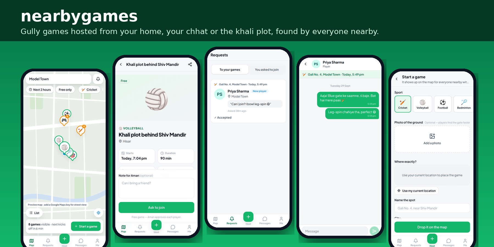
</p>

<h1 align="center">nearbygames</h1>

<p align="center">
  <b>Gully cricket in your lane. Volleyball on the empty plot. Carrom at home.</b><br/>
  The hyperlocal way to play in Bharat: host a game wherever you already play, and everyone nearby can find it and join.
</p>

<p align="center">
  
  
  
  
  
</p>

---

## Why nearbygames

In most of India, and especially in Tier-2 and Tier-3 towns, people don't play at stadiums or ₹1,500-an-hour turfs. They play **in the gali, on the chhat, on the khali plot behind the mandir, on the school ground after hours, or around a carrom board at home**. The places already exist. What's missing is a way for the neighbours down the road to know a game is on.

Today, a game fills up by shouting *"cricket khelega?"* down the lane, or by forwarding a message to five WhatsApp groups and hoping. nearbygames turns **any home or empty space into a venue**:

- 🏠 **Host from wherever you are.** Drop a pin on your lane, your terrace or the empty plot. No booking, no venue partner.
- 📍 **Everyone within a few kilometres sees it on a map**, with the sport, the time, how many spots are left and a note like *"blue gate, ground floor"*.
- 🙋 **Free games are a request.** The host sees who is asking (a reliability badge, a rough distance, their note) before saying yes. That matters when strangers are coming to your galli or your home.
- 💸 **Paid games are a transaction.** Splitting a box-cricket turf or a volleyball net? Set ₹50 a head, and players pay by UPI, wallet or cash at the ground and they're in, with no approvals to manage.
- 💬 **Chat opens the moment you're in**, so the exact gate and who brings the ball get sorted there, not in public.

> **The one rule:** a free game never lets you skip the host's yes, and a paid game never makes you wait for one.
> It's enforced in the database (Postgres row-level security and functions), not just in the UI.

---

## See it in action

> The demos were recorded on a phone-sized screen against the demo data in [`supabase/seed.sql`](supabase/seed.sql): gully games around Model Town, **Hisar**. They were recorded without a Google Maps key, so the map is the built-in preview map. With a key, the same pins sit on real Google Maps streets.

<table>
  <tr>
    <td align="center" width="50%">
      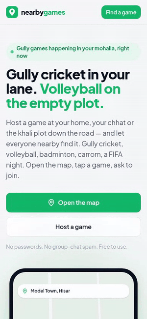<br/>
      <b>1 · Find a gully game and ask to join</b><br/>
      <sub>Open the map, tap the cricket pin in Gali No. 4, sign in with a one-time code, pick your sports, leave a note for the host and ask to join. The chat stays locked until the host says yes.</sub><br/>
      <a href="docs/media/01-find-and-join.mp4">▶ MP4 (33 s)</a>
    </td>
    <td align="center" width="50%">
      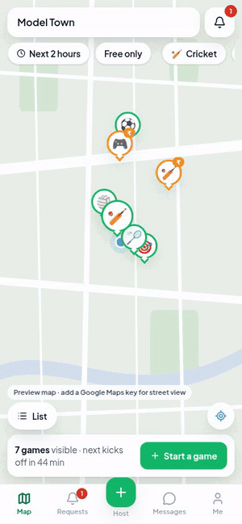<br/>
      <b>2 · The host says yes and the chat opens</b><br/>
      <sub>The bell badge shows a waiting request. The host sees Priya's note and reliability, taps Accept, and a chat opens straight away: <i>"Aaja! Blue gate ke saamne, 6 baje."</i></sub><br/>
      <a href="docs/media/02-host-accepts.mp4">▶ MP4 (16 s)</a>
    </td>
  </tr>
  <tr>
    <td align="center">
      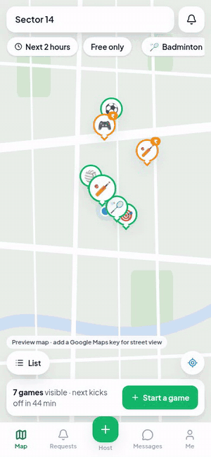<br/>
      <b>3 · Host a game on the khali plot</b><br/>
      <sub>Tap Start a game, choose Volleyball, drop the pin with "use my current location", name the spot, set players and notes, then "Drop it on the map". It's live for everyone nearby within seconds.</sub><br/>
      <a href="docs/media/03-host-a-game.mp4">▶ MP4 (21 s)</a>
    </td>
    <td align="center">
      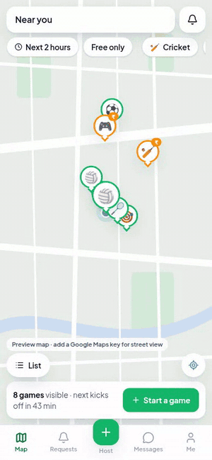<br/>
      <b>4 · Pay your share and you're in</b><br/>
      <sub>Paid games need a fuller profile. Fill it in once, pick wallet, UPI, card or cash at the ground, pay ₹65 (₹60 share + ₹5 fee) and the chat with the host opens. There's no approval step.</sub><br/>
      <a href="docs/media/04-paid-game.mp4">▶ MP4 (13 s)</a>
    </td>
  </tr>
</table>

<p align="center">
  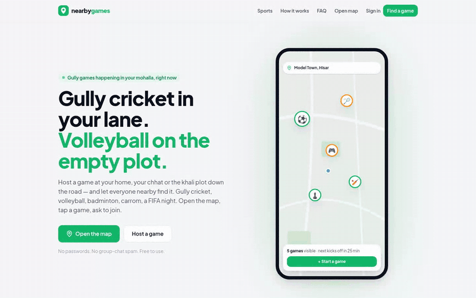<br/>
  <b>5 · Works on tablet and desktop too:</b> landing page, map with a live game list, and a public game page Google can index. <a href="docs/media/05-desktop.mp4">▶ MP4</a>
</p>

---

## Screens

<table>
  <tr>
    <td align="center">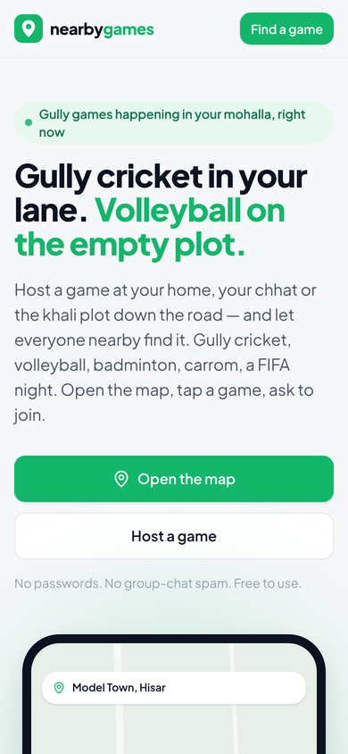<br/><sub>Landing</sub></td>
    <td align="center">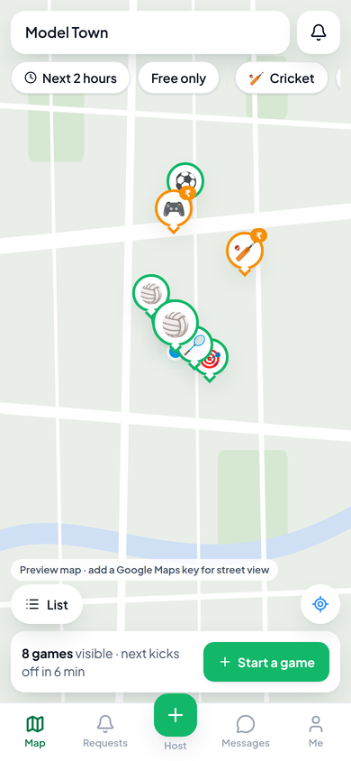<br/><sub>Map: every game nearby</sub></td>
    <td align="center">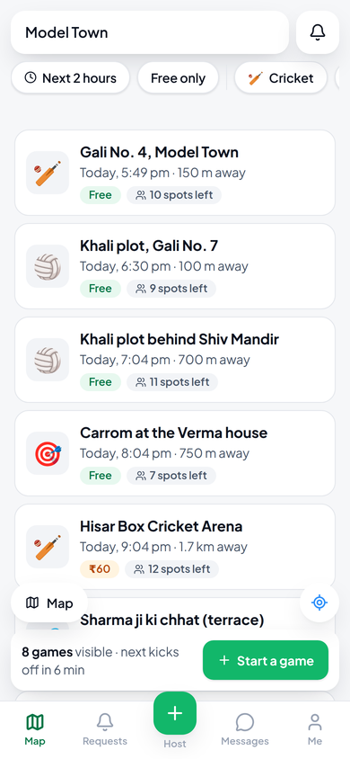<br/><sub>List view</sub></td>
    <td align="center">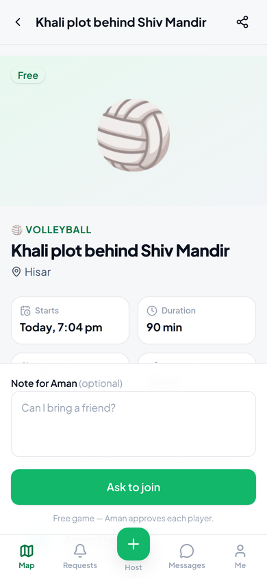<br/><sub>A free game: ask to join</sub></td>
  </tr>
  <tr>
    <td align="center">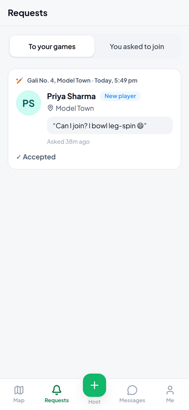<br/><sub>Requests to your games</sub></td>
    <td align="center">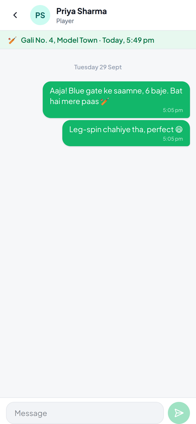<br/><sub>Chat opens once you're in</sub></td>
    <td align="center">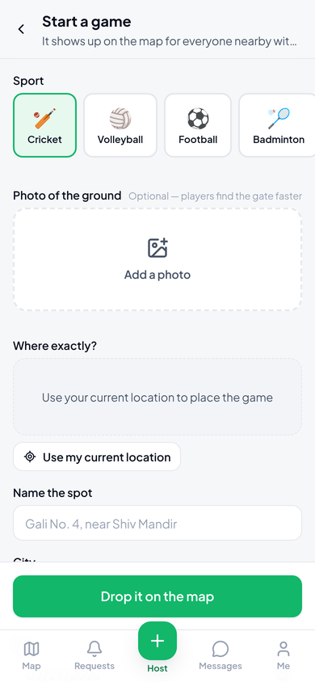<br/><sub>Start a game</sub></td>
    <td align="center">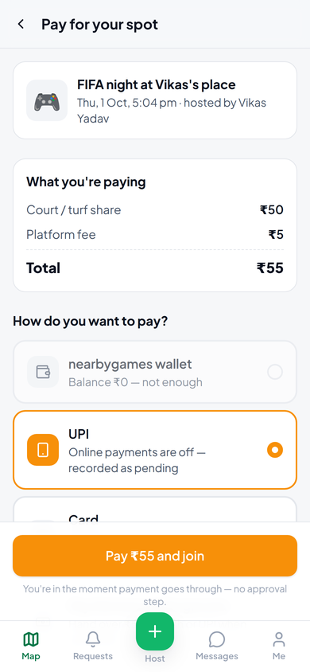<br/><sub>Pay for a spot</sub></td>
  </tr>
  <tr>
    <td align="center">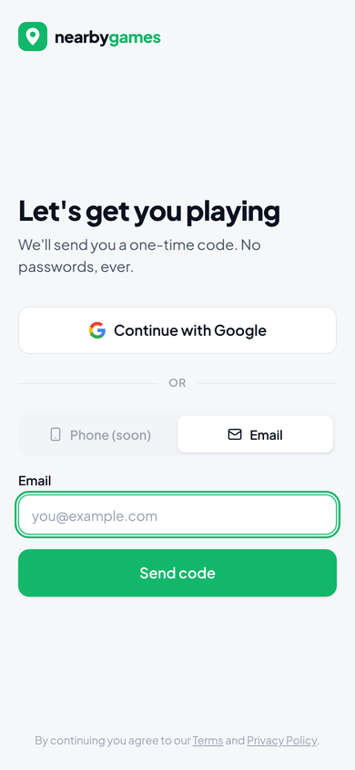<br/><sub>Sign in, no passwords</sub></td>
    <td align="center">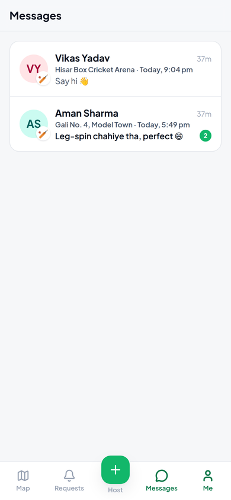<br/><sub>Messages</sub></td>
    <td align="center">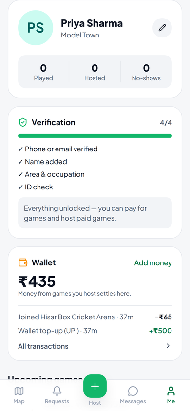<br/><sub>Me: stats, verification, wallet</sub></td>
    <td></td>
  </tr>
</table>

---

## What people host on it

| | Game | Where it happens | Typical setup |
|---|---|---|---|
| 🏏 | **Gully cricket** | Your lane, the society ground | Free · 10–12 players · tennis ball, "one-tip-one-hand" |
| 🏐 | **Gully volleyball** | The khali plot, a school ground | Free · net tied between two poles |
| 🏸 | **Terrace badminton** | Someone's chhat | Free · 4 players · lights till 10 |
| 🎯 | **Carrom / board games** | At home | Free · 4–8 players · chai included |
| 🏏 | **Box cricket** | A local turf | Paid · ₹50–100 a head splits the booking |
| ⚽ | **7-a-side football** | School ground after hours | Free · 14 players |
| 🎮 | **FIFA night** | Someone's living room | Paid · ₹50 covers snacks |

Chess, basketball, tennis, table tennis, pickleball, running and "anything else" are built in too.

---

## Features

**For players**
- A live **map of games within a few kilometres**, with filters for *next 2 hours*, *free only* and by sport. The nearest game is shown bigger and paid games in amber. There's a list view too.
- **Ask to join** free games with a note ("Can I bring a friend?"), and withdraw any time before the host answers.
- **Pay and join instantly** for paid games: nearbygames wallet, **UPI (QR / Google Pay / PhonePe / Paytm / UPI ID via Razorpay)**, card, or cash to the host at the ground.
- **Requests** tab showing where every request stands (waiting, accepted with a chat button, or declined with the host's reason).
- **Realtime chat** with the host, with optimistic sending and retry.

**For hosts**
- **Start a game in about 30 seconds**: sport, optional photo of the spot, a pin placed by dragging the map or with *use my current location*, time, players, free or paid, and notes.
- **Accept or decline** each request, seeing the player's **reliability badge** (new / regular / flaked before), a **rough distance band** and their note.
- **Host tools**: mark no-shows after the game starts, or cancel a game. Anyone who paid is refunded to their wallet automatically.
- **Wallet** for your share of paid games, plus in-app pings and browser notifications.

**Trust & privacy, built for playing with neighbours**
- Sign in with a **one-time code** (email today, phone OTP ready to switch on) or Google. No passwords.
- **Your live location never leaves your phone.** Other players only see a rounded distance. Your saved neighbourhood is rounded to about 100 m and only you can read it.
- Hosts see a **coarse distance band** ("1–3 km"), fixed when the request is made. A game's pin **can't be moved** once someone has asked or joined, so nobody can work out where a player lives.
- **Hosting at home?** Drop the pin at your lane or a landmark and share the exact house in chat after you accept someone.
- A **chat opens once you're in the game**, or earlier if the host wants to talk to you about your request first. If the request is declined or withdrawn, that chat becomes read-only.
- **Ratings and reviews**: after a game starts, the people who played can rate each other from 1 to 5 stars. Reviews show on profiles and request cards but never say which game they came from.
- **Email updates**: hosts get an email for every new request (with the player's rating and a blue tick if their ID is verified), and players get an email when they're accepted or declined.

**Built to be found**
- Public, server-rendered pages for every game (with event structured data and a share image), plus pages for each sport and each sport in each city (e.g. `/play/cricket/hisar`), a sitemap and robots rules.
- Installable as an app on your phone's home screen, responsive from a 360 px phone to a desktop, and light and dark mode.

---

## How it's built

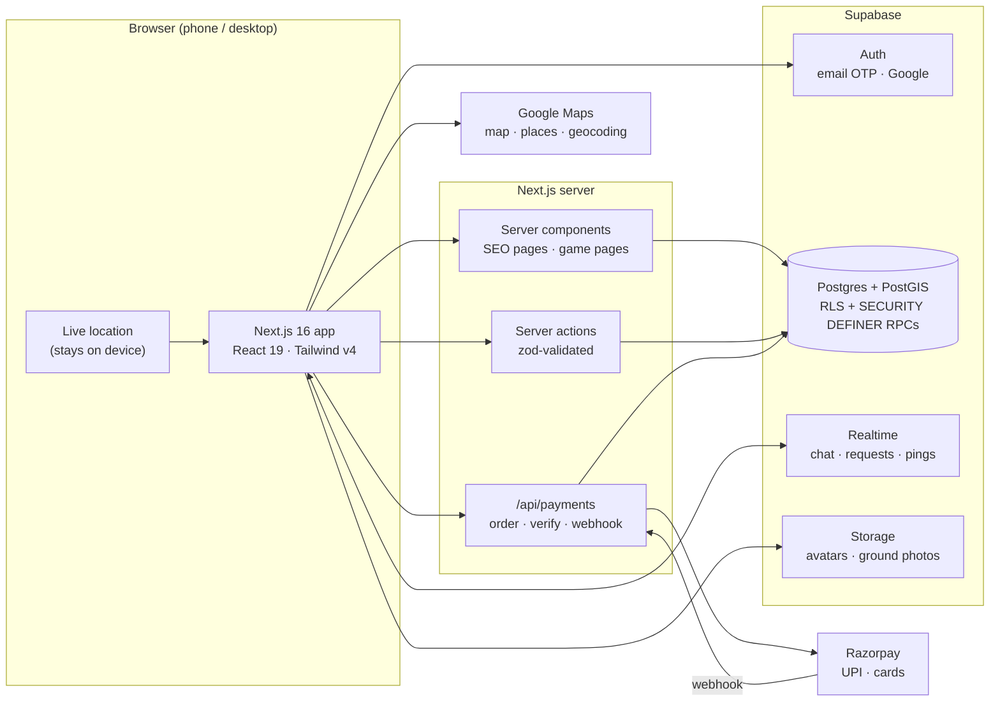

| Part | Choice |
|---|---|
| App | **Next.js 16** (App Router, Turbopack, Server Actions), TypeScript, **Tailwind CSS v4** |
| Data, auth, realtime, files | **Supabase** free tier: Postgres + **PostGIS** ("games near me" is one query), Auth, Realtime, Storage |
| Maps | **Google Maps** (Advanced Markers, Places, Geocoding), with a built-in preview map when no key is set |
| Payments | **Razorpay** (UPI, cards), in-app wallet, pay in person |
| Hosting | **Vercel** free tier |
| Quality | SQL tests for the core rules, unit tests (Vitest), ESLint, type-check, and CI on every push |

---

## Run it yourself

```bash
git clone https://github.com/rohitsch1/nearbygames.git
cd nearbygames
npm install
cp .env.example .env.local   # add your Supabase keys (Maps and Razorpay are optional)
npm run dev                  # http://localhost:3000
```

Apply `supabase/migrations/20260928000000_init.sql` to your Supabase project first. To see the Hisar demo games, run `supabase/seed.sql` against a **local or test** database.

**Full step-by-step setup** (Supabase auth emails, Google sign-in, Maps key, Razorpay + UPI, deploying to Vercel) is in **[docs/SETUP.md](docs/SETUP.md)**.

```bash
npm run lint        # ESLint
npm run typecheck   # TypeScript
npm test            # unit tests
DATABASE_URL=postgres://… npm run test:db   # rule tests against an empty Postgres with PostGIS
```

---

## Roadmap for Bharat

- [ ] **Hindi and regional languages** (हिंदी, मराठी, தமிழ், বাংলা …)
- [ ] **Phone OTP** as the default sign-in (built; needs an SMS provider such as MSG91)
- [ ] **Kabaddi, kho-kho, carrom and gilli-danda** as their own categories
- [ ] **Share a game to WhatsApp** with a rich preview card
- [ ] **Society / campus groups**: private games only your building can see
- [ ] Push notifications when the app is closed, and a lighter mode for slow 3G connections
- [ ] Real ID verification (DigiLocker) and payouts to the host's bank account

---

<p align="center">
  <sub>Made for everyone who has ever stood in the lane shouting <i>"ek aur chahiye!"</i> 🏏</sub>
</p>
